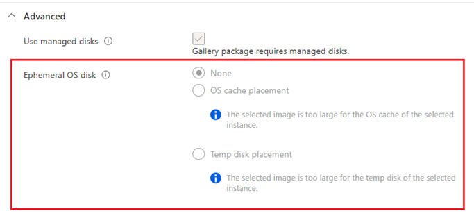

# 2024-09-20-A’ dan Z’ye Azure VM: Bölüm 6 – Geçici Işletim Sistemi Diskleri

Hyper-V üzerinde çalışmakta olan Azure sanal makianlar yerel (local) ve uzak (remote) olmak üzere iki farklı depolama birimi kullanmaktadır.

Yerel diskler, Azure sanal makinaların o an çalışmakta olduğu fizilsel sunucuya ait disklerdir. Bu diskler kalıcı olmayan disklerdir (Non-persistent) yani sunucunun yeniden başlatılması gibi durumlarda içerisindeki veriler silinir.

Uzak diskler ise bir depolama cihazında (Storage) bulunan ve ve tüm fiziksel sunuculara bağlanabilen disklerdir. Yerel disklerin aksiye kalıcı disklerdir yani disk içerisine yazılan veriler hiç bir şekilde silinmez.

Uzak diskler verileri saklayabilme gibi bir avantaja sahip olsalarda, yerek diskler sanal makina ile aynı fiziksel sunucu üzerinde bulunduklarından daha hızlıdırlar ve uzak disklerin aksine ücretsizdirler.

## Geçici işletim sistemi diskleri (Ephemeral OS disks)

<figure><figcaption></figcaption></figure>

Daha önce söylediğimiz gibi yerel diskler uzak disklere göre daha performanslı ve ücretsizdirler ancak üzerlerinde veri tutmazlar. Mantık olarak Azure sanal makinalarda genelde D diski olarak karşımıza çıkan geçici disklerle aynı mantıkta çalışırlar. &#x20;

Geçici diskleri işletim sistemi diski olarakta kullanabilirsiniz. İşletim sistemi diski olarak, gecici diskleri kullanmanız durumunda yerel disk üzerinde çalışacak işletim sistemi düşük okuma/yazma gecikmesi ile daha iyi bir performans sağlayacaktır, hemde sanal makina oluşturma süresi, uzak disklere göre daha hızlı olacaktır ancak sanal makinanın yeniden boyutlandırılması (resize) yada yeniden dağıtılması (Redeploy) durumlarında işletim sistemi üzerine sonradan yazılan veriler (yüklenen uygulamalar vs.) silinecektir.

## Geçici işletim sistemi olan bir sanal makinada değişiklik yapmak

Daha önce bahsettiğimiz gibi geçici işletim sistemi diskleri üzerinde veri tutmaz, bu sebebten geçici bir disk kullanarak sanal makina oluşturulduktan sonra bir uygulama yüklemeniz mantıklı olmayacaktır.

Bunu yapabilmek için:

1. Normal bir sanal makina oluşturun (uzak disk kullanarak)
2. İstediğiniz uygulama ve özelleştirmeleri bu makina üzerinde tamamlayın
3. Sanal makinayı Azure Compute Gallery (Shared Image Gallery) ‘ya Imaj olarak ekleyin
4. Oluşturduğunuz bu imajı kullanarak, geçici diske sahip sanal makina oluşturun.

Geçici disklerin genel özellikleri:

* Marketplace ve custom images’ler ile kullanılabilirler
* Reimage seçeneği ile hızlı bir şekilde sıfırlanabilirler
* Düşük geçikmeye sahiptirler -> Makina oluşturken %50 lik bir fark.
* Ücretsizdirler !
* Tüm Azure bölgelerinde kullanılabilir durumdadılar
* Geçici işletim sistemi diskine sahip makinalar başlat-durdur (start-stop) yapılamazlar
* İşletim sistemi disk boyutu değiştirilemezler.
* Uzak disklere göre daha performanslıdırlar

Geçici işletim sistemi diskleri, üzerinde bir veri tutmayan uygulamalar, Azure Virtual Desktop ortamları, Test ve geliştirme ortamları için kullanılabilir.

Daha fazlası için:

[https://learn.microsoft.com/en-us/azure/virtual-machines/ephemeral-os-disks](https://learn.microsoft.com/en-us/azure/virtual-machines/ephemeral-os-disks)
